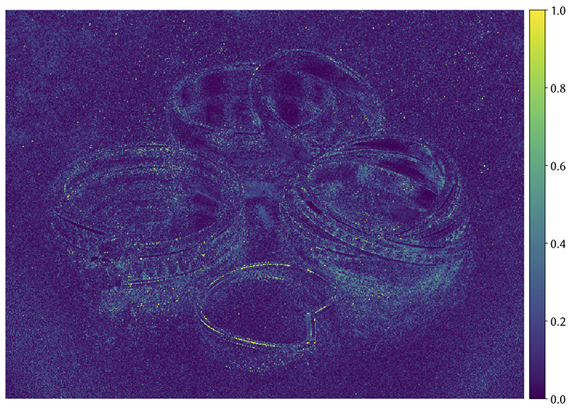

# 🔎 Online Test Suite for Rendering

_A web comparison tool for rendering research, forked from the [online test suite by Disney Research](https://tom94.net/data/publications/mueller18neural/interactive-viewer/)._

## Dependencies

### Python

* [PyEXR](https://github.com/tvogels/pyexr) (0.3.6)
* [NumPy](http://www.numpy.org/) (1.14.2)
* [Matplotlib](https://matplotlib.org/) (2.2.3)
* [Pillow](https://pillow.readthedocs.io/en/latest/index.html) (5.2.0)
* [BeautifulSoup](https://www.crummy.com/software/BeautifulSoup/bs4/doc/) (4.7.1)

To install the latest version of all packages, run:

```python3 -m pip install --user -r tools/requirements.txt```

### JavaScript
* [JERI](https://jeri.io/)
* [Chart.js](https://www.chartjs.org/)
* [Plotly.js](https://plot.ly/javascript/)

## Creating a new scene

To add a new scene, simply run:

```python3 tools/create_scene.py --name "Jewelry" --root ./```

This creates a new scene directory with an `index.html` template, ready to be populated with data. Here, `root` represents the top directory.

## Initializing a scene

To add a render, you first need to specify a reference and a base algorithm (e.g. path tracing), along with the metrics to be computed. For instance, this can be done by calling the following command:

```bash
python3 tools/analyze.py --ref Reference.exr \
                         --tests Path-Tracing.exr \
                         --dir scenes/jewelry/ \
                         --metrics mape mrse \
                         --epsilon 1e-2 \
                         --clip 0 1
```

The above computes the mean absolute percentage error ([MAPE](https://en.wikipedia.org/wiki/Mean_absolute_percentage_error)) and the mean relative square error (MRSE) between the reference and the test image. Below is a table of all arguments; run with `--help` for more info.

| Parameter | Description | Requirement |
|:----------|:------------|:--|
| `ref` | Reference image | Required |
| `tests` | Test image(s) | Required |
| `dir` | Scene viewer directory | Required |
| `metrics` | Metric(s) to compute | Required (Options: `l1, l2, mape, smape, mrse`) |
| `epsilon` | Epsilon when computing metric (avoids divison by zero) | Optional (Default: `1e-2`) |
| `clip` | Pixel range for false color images | Optional (Default: `[0,1]`) |

By default, the algorithm name is the test file name, with `-` replaced with spaces. For instance, `Path-Tracing.exr` gets parsed as "Path Tracing": this is what it is referred to in the interactive viewer.


Behind the curtains, this script creates false color images and saves them as LDR  (PNG) images in the scene directory. A thumbnail is also generated for the index. Most importantly, a `data.js` file is written to disk, which is then used by JS to display all images and metrics in the browser. This file can only be created by `tools/analyze.py`, which is why it has to be ran first before adding new renders.

## Rendering a new image
The script `tools/render.py` is used to render a new image with [Mitsuba](http://www.mitsuba-renderer.org/) and add it to an existing scene viewer. It provides a way to iterate over a particular algorithm and immediately see how it compares against other previously computed images.

```bash
python3 tools/render.py --mitsuba ./mitsuba \
                        --ref scenes/jewelry/Reference.exr \
                        --scene ../mitsuba/scenes/jewelry/scene.xml \
                        --dir scenes/jewelry/ \
                        --name "My Algorithm" \
                        --alg "my-alg" \
                        --timeout 65 \
                        --frequency 60 \
                        --metrics mape mrse
```

| Parameter | Description | Requirement |
|:---------|:------------|:--|
| `mitsuba` | Path to Mitsuba executable | Required (Default: `./mitsuba`) |
| `ref` | Reference image | Required |
| `scene` | Mitsuba XML scene file | Required |
| `dir` | Scene viewer directory | Required |
| `name` | Full name of the algorithm | Required |
| `alg` | Mitsuba keyword for algorithm | Required |
| `metrics` | Metric(s) to compute | Required (Options: `l1, l2, mape, smape, mrse`) |
| `options` | Mitsuba options (e.g. `-D var=value`) | Optional
| `timeout` | Terminate program after _N_ seconds | Optional |
| `frequency` | Output intermediate image every _N_ seconds | Optional |
| `epsilon` | Epsilon when computing metric (avoids divison by zero) | Optional (Default: `1e-2`) |
| `clip` | Pixel range for false color images | Optional (Default: `[0,1]`) |

Note that the scene file _needs_ to have the following line in order to use different integrators. This is to ensure that the same geometry and light configuration is being rendered across algorithms.

```xml
<integrator type="$integrator"> 
    ...
</integrator>
```


If the render name already exists, the script overwrites its false color images and corresponding metrics. If not, it inserts it into the `data.js` dictionary.

## Manually adding a rendered image

It is possible to manually add a rendered image to the scene viewer. The easiest solution is to add the image to the scene viewer directory and recompute the metrics over all images:

```bash
python3 tools/analyze.py --ref Reference.exr \
                         --tests Render-1.exr Render-2.exr Render-3.exr \
                         --dir scenes/jewelry/ \
                         --metrics mape mrse \
```
Note that by doing so, you will overwrite previously added scenes.

# 📊 Standalone Metrics

A standalone script is provided to compute various metrics without an integration with JS. This is actually what is being used under the hood of previously discussed scripts. 

| Parameter | Description | Requirement |
|:---------|:------------|:--|
| `ref` | Reference image | Required |
| `test` | Test image | Required |
| `metrics` | Metric to compute | Required (Options: `l1, l2, mape, smape, mrse`) |
| `epsilon` | Epsilon when computing metric (avoids divison by zero) | Optional (Default: `1e-2`) |
| `clip` | Pixel range for false color images | Optional (Default: `[0,1]`) |
| `falsecolor` | False color heatmap output file | Optional |
| `colorbar` | Output heatmap with colorbar for PDF embedding | Optional |
| `plain` | Only output metric | Optional |

## Examples

### Metric and False Color
```
python3 tools/metric.py --ref Reference.exr \
                        --test Render-1.exr \
                        --metric mape \
                        --falsecolor MAPE.png
```

```
MAPE = 0.1164 (Min = 0.0000, Max = 9.1742, Var = 0.0141)
False color heatmap written to: MAPE.png
```

### Metric and False Color + Colorbar (PDF)

```
python3 tools/metric.py --ref Reference.exr \
                        --test Render-1.exr \
                        --metric mape \
                        --falsecolor MAPE.png
                        --colorbar
```

```
MAPE = 0.1164 (Min = 0.0000, Max = 9.1742, Var = 0.0141)
False color heatmap written to: MAPE.png
False color heatmap (with colorbar) written to: MAPE.pdf
```

### Only Metric

```
python3 tools/metric.py --ref Reference.exr \
                        --test Render-1.exr \
                        --metric mape \
                        --plain
```

```
0.116442
```

### Outputs

<table align="center">
  <tr align="center">
    <td colspan=3></td>
    <td colspan=3></td>
    <td colspan=3></td>
  </tr>
  <tr align="center">
    <td colspan=3>Reference</td>
    <td colspan=3>MAPE</td>
    <td colspan=3>MAPE + Colorbar (PDF)</td>
  </tr>
</table>


# 🗒 TODOs
- [ ] Track convergence over time
- [ ] Make scripts more robust by handling exceptions

# 👏🏻 Acknowledgments
* [JERI](https://jeri.io/)'s team at Disney Research for providing the interactive viewing tool.
* [Jan Novák](http://drz.disneyresearch.com/~jnovak/) who wrote the Chart/Table JS files.